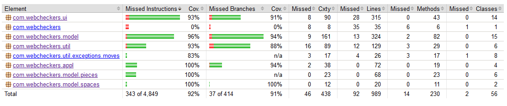
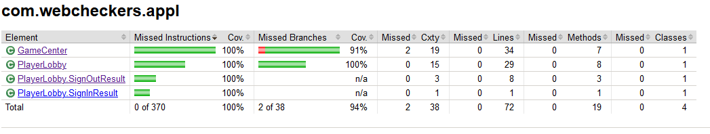

# PROJECT Design Documentation

## Team Information
* Team name: s1-d-labrats
* Team members
  * Mike White
  * David Allen
  * Will Petersen
  * Sokol Nguyen
  * Rafeed Choudhury

## Executive Summary

This is a project that implements the game of Checkers on a web server. 

### Purpose

The purpose is to allow Checkers players to play a fully-featured game of Checkers online in a web browser.

### Glossary and Acronyms

| Term | Definition |
|------|------------|
| VO | Value Object |
| MPV | Minimum Viable Product|
| UI | User Interface |
| CSS | Cascading Style Sheet |
| HTML | Hyper Text Markup Language |
| FTL | FreeMarker Template |

## Requirements

The goal is to provide a checkers experience online. The user must be able to:
* Sign in and out
* See other players currently logged in and games currently being played
* Select other human players to play a game with
* Play a full game of checkers using the American rules, including moving pieces, taking turns, jumping pieces, creating kings, etc.
* Resign the game at any time either through the resign button or signing out
* Never crash the server, meaning at worst they receive an error message

### Definition of MVP

The Minimum Viable Product of Web Checkers is an app that allows two players to play a full game of checkers together
with the American rules. The required features are discussed below.

### MVP Features
* Sign in/out
* Select another player to enter a game with
* Move pieces
* Jump and take opponent's pieces
* Create kings by pieces to the opposite side of the board
* Win/lose a game when a player's pieces are all gone
* Resign at any time

### Roadmap of Enhancements
* An AI player for the user to play against
* A spectator mode that allows the user to see a match between two other players

## Application Domain

Our domain model represents a standard game of Checkers. Two players play a game of Checkers.
The game is played on a board, which contains 64 squares. Each player controls 12 pieces which are
each placed on a square, which has to be black. The pieces can either be single pieces or king pieces.
King pieces can move in all four directions and single pieces can only move forward diagonally. The player
can choose to play against an AI player.

## Architecture and Design
### Summary

The following Tiers/Layers model shows a high-level view of the webapp's architecture.

As a web application, the user interacts with the system using a
browser.  The client-side of the UI is composed of HTML pages with
some minimal CSS for styling the page.  There is also some JavaScript
that has been provided to the team by the architect.

The server-side tiers include the UI Tier that is composed of UI Controllers and Views.
Controllers are built using the Spark framework and View are built using the FreeMarker framework. 
The Application and Model tiers are built using plain-old Java objects (POJOs).

Details of the components within these tiers are supplied below.

### Overview of User Interface

This section describes the web interface flow; this is how the user views and interacts
with the WebCheckers application.

When the player first goes to WebCheckers, they're able to see the number of other players signed in and there's a button allowing them to sign in. When the
player clicks on that, they're sent to the Sign-In page. Once they've entered a valid
username, they're taken back to the Homepage. There, they'll see the names of other human and AI players, and games currently being played. 
Clicking on a human or AI player will allow them to player a game against that player and be taken to the Game page.
On the Game page, there are controls for moving pieces, resigning, backing up a move, and submitting a turn. When the game ends,
they're taken back to the home page.
When clicking on a game between other players, the player is able to spectate the game being played. They'll be taken to the Game page,
showing the game being played in real-time and the controls to return to the Home page.

### UI Tier

The UI tier follows a relatively simple architecture. Each class handles its own route (eg `POST /signin`). The route will
perform some logic, getting and sending data to and from the application tier, and either render a page for the user
to see or redirect them to a new route where that route will then take over. Each route handler is as follows:

When the user first opens the web application, they will get the home page via `GET /`. The `GetHomeRoute` handler looks in
the application tier to see if the user is signed in. Because the user isn't, they will be shown a link to `GET /signin`
where they can sign in, and will only be shown a number of players (for privacy reasons). The `GetSignInRoute` handler will
render the sign in page for the user, and provide a text box for them to enter a username. The sign-in button will perform
a `POST /signin`, where the `PostSignInHandler` will interact with the HTTP session and the `PlayerLobby` to attempt to 
sign in the player. If successful, they're redirected to the home page. If not, they're sent back to the sign-in page.

Back in the home page, the user has two options. They can sign back out, performing a `POST /signout` where the
`PostSignOutRoute` handler will interact with `PlayerLobby` to sign the user out. They can also select a player from a
list of signed-in players to start a match with. If the user is already in a match, they'll be shown an error message.
Otherwise, it will perform a `GET /game` and interact with `GameCenter` to start a match between the user and another player.

In the match, the user will check to see if it's their turn via `POST /checkTurn`. This route handler will perform that
check by interacting with `GameCenter`. If it's the user's turn, they'll be able
to move a piece. When the user moves a piece, it'll perform a `POST /validateMove` to check if the move is valid (eg. if
the player performed any necessary jumps). If the move isn't valid, it will put the piece back and describe why. If it was
valid, they'll have to option to either submit the move or back up, performing a `POST /submitTurn` or `POST /backupMove`
respectively. These route handlers all interact with `GameCenter` and `Board` to perform these operations. If the user wants to
resign, the `POST /resign` call the `PostResignGameRoute` handler. This will check if it's the player's turn, and resign them 
if it is. 

Eventually, one player's pieces will all be gone. Checks in the `PostCheckTurnRoute` will look for this and notify the
user of their win or loss. They will then have the option to go back to the home screen.

The user is also allowed to spectate other games. When they click on a game to spectate, the `GetSpectatorGameRoute` handler
will handle the `GET /spectator/game` request, and render the game as it's being played. To refresh each turn, a `POST /spectator/checkTurn`
request is made and handled by `PostSpectatorCheckTurnRoute`. To stop watching, a `POST /spectator/stopWatching` request
is made and handled by `PostSpectatorStopWatching`.

### Application Tier

There are two classes that allow the route handlers to interact with the model tier and perform game logic. The user
will initially interact with the `PlayerLobby`, where all player and sign-in related features are handled. When a user 
signs in, signs out, or selects another player to create a match with, the `PlayerLobby` will handle these. The `PlayerLobby`
itself interacts with Model tier through `Player`. 

During a match, the user (and the route handlers in the UI tier) interact with `GameCenter`. This class performs
all game-related operations, from creating a game to providing methods to move pieces. The `GameCenter` interacts with the
rest of the Model tier (eg. `Board`, `Game`, `Piece`, etc). 

### Model Tier

The Model tier holds the classes for the application's data and logic. 

The `Game` class represents a match, and has two `Player`'s and a `Board`. The `Board` has a list of `Row`s, and each row has
a list of `Space`s. Each `Space` has a color, and can either be an empty `WhiteSpace` or a `BlackSpace` with or without
a `Piece` on it. Each `Piece` has a `Position` and can be either a `RedKingPiece`, `WhiteKingPiece`, `RedSinglePiece`,
or `RedKingPiece`. A move by the player is represented by the `Move` class. When playing against an AI player, an 
`AIPlayer` will be used in place of a `Player`.

### Design Improvements

* Remove the use of enumerations in the `Piece` class
* Utilize the `Position` class more throughout the code base
* Fix a number of Law of Demeter violations, but without over-complicating classes
* Move some of the logic from the route handlers to the application tier or model tier
* Create a variant of the WinType enum that represents a resignation
* Use primitive arrays instead of ArrayLists where possible
* Override the `equals()` and `hashCode()` methods for more classes
* Use more constant strings instead of literals
* `redirectHomeWithMessage()` should be a public utility function
* Create an `isBlack()` and `isWhite()` to check the color of a space
* Store the player whose turn it is in the Game class
* Make EvenRow and OddRow classes for constructing the Board
* Split up complicated methods into more smaller methods
* Use a second HashMap in GameCenter to map Players to games

## Testing

We have 266 unit tests and they all pass. We also run the application ourselves and play through games of checkers to
make sure they play correctly. 

### Acceptance Testing

We have 14 short user stories, 50 acceptance testing criteria and all of them passes without issue. All of the user stories
had acceptance testing done.

### Unit Testing and Code Coverage

We hope to meet the code coverage requirements listed on the rubric, which is 90%. We currently have 94% of instructions
covered and 91% of branches covered. All of our unit tests pass. Our strategy is to write the unit
tests before we write the code.  

